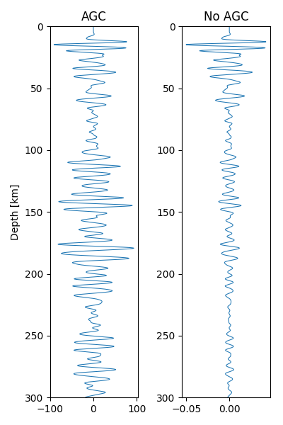

First uncompress SDI.tar.gz by
 
>> tar zxvf SDI.tar.gz

Here I directly provide the waveforms in SDI/good/IU.MBWA.00 folder after the processing procedures, which is ready for P reflectivity construction.

Then, run run_sdi.py

>> python run_sdi.py

and

>> python plot.py

You would see the final P reflectivity beneath the IU.MBWA station in Western Australian Craton.

